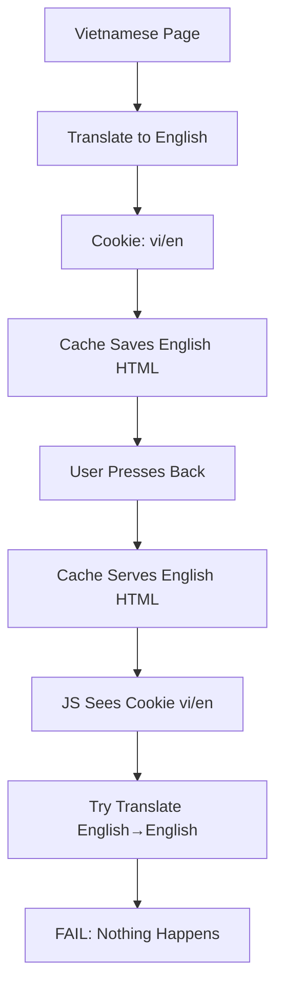

# Production Cache Analysis - GTranslate WordPress Plugin

## Issue Overview

### Problem Description
GTranslate plugin works perfectly on localhost but fails on production environments with multiple cache layers. The specific issue occurs when users navigate using browser back/forward buttons.

### Environment Details
- **Production Stack**: WP Rocket + W3 Total Cache + Cloudflare
- **Localhost**: No caching layers (works perfectly)
- **Affected Scenario**: Translation → Navigation → Back button

## Root Cause Analysis

### Cache Layer Interaction
```
1. User on Vietnamese page (panda.misa.vn/tinh-nang)
2. Translates to English → Cookie: googtrans=/vi/en
3. Cache layers save English HTML content
4. User presses back button
5. Cache serves English HTML (not Vietnamese original)
6. JavaScript sees cookie vi/en → Tries to translate English to English
7. Translation fails (nothing to translate)
```

### Technical Flow Breakdown


## Cache Layers Impact

### WP Rocket
- **Function**: Page caching + minification
- **Impact**: Caches translated HTML pages
- **Problem**: Serves cached English content when Vietnamese expected

### W3 Total Cache
- **Function**: Database + object + page caching
- **Impact**: Multiple caching layers compound the issue
- **Problem**: Additional layer of cached content

### Cloudflare
- **Function**: CDN + edge caching
- **Impact**: Global edge caching of translated content
- **Problem**: Serves cached content from edge locations

## Detection Strategy

### Cache Conflict Detection
```javascript
// Check if cookie indicates translation but content is original
var translationCookie = document.cookie.match('(^|;) ?googtrans=([^;]*)(;|$)');
var translatedElements = document.querySelectorAll('font[style*="vertical-align: inherit"]');

if (translationCookie && !translatedElements.length) {
    // Cache conflict detected - cookie says translated but no translated elements
    console.log('CACHE CONFLICT: Cookie indicates translation but content is original');
}
```

### Content State Analysis
```javascript
// Multiple detection criteria
1. Translation cookie presence and value
2. Translated elements count (Google Translate markers)
3. Page load source (cache vs fresh)
4. Navigation type (back/forward vs direct)
```

## Solution Architecture

### 1. Enhanced Pageshow Detection
- Detect cache conflicts on every page load
- Compare cookie state vs actual content state
- Force reload when mismatch detected

### 2. Production Cache Bypass
- Inject cache bypass headers for translated pages
- Add cache-busting parameters to URLs
- Set appropriate meta tags to prevent caching

### 3. Multi-Layer Cache Handling
- **WP Rocket**: PHP-level cache bypass
- **W3 Total Cache**: Filter-based exclusion
- **Cloudflare**: Header-based bypass

### 4. Safeguards
- Prevent infinite reload loops
- Cooldown periods for navigation events
- Smart detection to avoid unnecessary reloads

## Implementation Strategy

### Phase 1: Detection Enhancement
```javascript
// Enhanced pageshow event with cache conflict detection
window.addEventListener('pageshow', function(event) {
    // Check for cache conflicts
    // Compare cookie vs content state
    // Force reload if mismatch detected
});
```

### Phase 2: Cache Bypass
```php
// WordPress PHP integration
function gtranslate_production_cache_bypass() {
    // Detect translated pages
    // Set cache bypass headers
    // Add cache-busting parameters
}
```

### Phase 3: Multi-Layer Integration
```javascript
// Client-side cache bypass
// Cloudflare-specific headers
// Browser cache prevention
```

## Expected Results

### Before Fix
```
Back Button → Cache Serves English HTML → Cookie: vi/en → Try Translate English → FAIL
```

### After Fix
```
Back Button → Detect Cache Conflict → Force Reload → Fresh Vietnamese HTML → Translate to English → SUCCESS
```

## Testing Strategy

### Test Scenarios
1. **Localhost vs Production**: Verify behavior difference
2. **Cache Layer Isolation**: Test each cache layer individually
3. **Navigation Patterns**: Test all navigation scenarios
4. **Performance Impact**: Measure reload frequency and performance

### Validation Criteria
1. **Consistency**: Same behavior on localhost and production
2. **Performance**: Minimal impact on page load times
3. **User Experience**: Smooth translation without visible issues
4. **Reliability**: Works across all supported browsers

## Risk Assessment

### Low Risk
- **Detection Logic**: Safe read-only operations
- **Cache Headers**: Standard HTTP headers
- **Reload Mechanism**: Existing proven pattern

### Medium Risk
- **Performance Impact**: Additional reloads may affect performance
- **User Experience**: Brief loading during cache conflict resolution

### Mitigation Strategies
- **Smart Detection**: Only reload when necessary
- **Performance Monitoring**: Track reload frequency
- **Fallback Mechanisms**: Graceful degradation if detection fails

## Success Metrics

### Technical Metrics
- **Cache Conflict Detection Rate**: % of conflicts detected
- **Resolution Success Rate**: % of conflicts resolved
- **Performance Impact**: Additional load time measurement
- **Error Rate**: JavaScript errors or failed translations

### User Experience Metrics
- **Translation Consistency**: Same behavior localhost vs production
- **Navigation Smoothness**: Seamless back/forward navigation
- **Loading Time**: Acceptable loading delays
- **User Satisfaction**: Reduced support tickets

This analysis provides the foundation for implementing a comprehensive solution to the production cache conflict issue.
