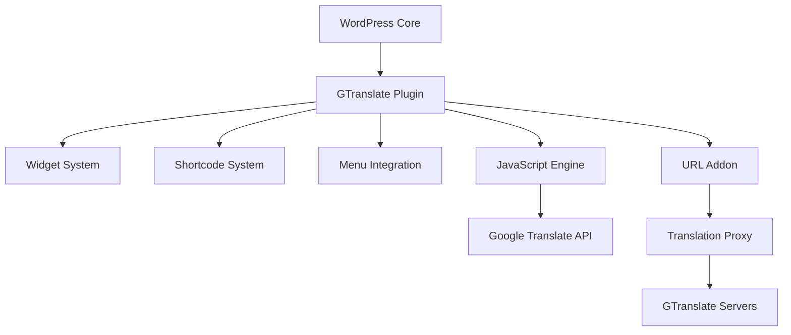

# System Patterns - GTranslate WordPress Plugin

## Kiến trúc tổng thể

### Plugin Architecture
```
GTranslate Plugin
├── Core Plugin (gtranslate.php)
├── Widget System (WP_Widget extension)
├── JavaScript Modules (js/)
├── Asset Management (flags/, CSS)
├── URL Addon (url_addon/) - Paid features
└── Configuration System (WordPress options)
```

### Component Relationships


## Core Design Patterns

### 1. Widget Pattern
```php
class GTranslate extends WP_Widget {
    // WordPress Widget API implementation
    // Handles widget rendering và configuration
}
```
- **Purpose**: Provides draggable widget cho WordPress sidebars
- **Benefits**: Native WordPress integration, user-friendly placement
- **Usage**: Appearance → Widgets → GTranslate

### 2. Shortcode Pattern
```php
add_shortcode('gtranslate', array('GTranslate', 'render_shortcode'));
add_shortcode('gt-link', array('GTranslate', 'render_single_item'));
```
- **Purpose**: Flexible content placement anywhere trong posts/pages
- **Benefits**: Developer-friendly, template integration
- **Usage**: `[gtranslate]`, `[gt-link lang="en" label="English"]`

### 3. Hook System Integration
```php
add_action('widgets_init', array('GTranslate', 'register'));
add_action('admin_menu', array('GTranslate', 'admin_menu'));
add_action('init', array('GTranslate', 'enqueue_scripts'));
add_filter('walker_nav_menu_start_el', array('GTranslate', 'render_menu_items'));
```
- **Purpose**: Deep WordPress integration
- **Benefits**: Follows WordPress standards, extensible
- **Usage**: Automatic registration và lifecycle management

### 4. Modular JavaScript Architecture
```
js/
├── base.js      - Core functionality
├── dropdown.js  - Dropdown widget style
├── float.js     - Floating language selector
├── flags.js     - Flag-based selectors
├── globe.js     - Globe widget style
└── popup.js     - Popup modal style
```
- **Purpose**: Lazy loading, performance optimization
- **Benefits**: Load only required modules, smaller bundle sizes
- **Pattern**: Module-specific functionality với shared base

### 5. Configuration Management Pattern
```php
public static function load_defaults(&$data) {
    // Merge user settings with defaults
    // Handle backward compatibility
    // Validate configuration options
}
```
- **Purpose**: Robust configuration handling
- **Benefits**: Backward compatibility, validation, defaults
- **Usage**: Settings persistence và migration

## Data Flow Patterns

### 1. Free Version Flow
```
User clicks language → JavaScript detects → Google Translate Widget → Page translation
```

### 2. Paid Version Flow
```
User clicks language → Redirect to subdomain/subdirectory → Translation Proxy → Cached translated page
```

### 3. Configuration Flow
```
Admin settings → WordPress options → JavaScript configuration → Widget rendering
```

## Performance Patterns

### 1. Lazy Loading Pattern
```javascript
// Scripts loaded only when needed
if (widget_look === 'dropdown') {
    loadScript('dropdown.js');
}
```
- **Purpose**: Reduce initial page load
- **Benefits**: Better Core Web Vitals scores
- **Implementation**: Conditional script loading

### 2. CDN Asset Pattern
```php
$cdn_url = $data['enable_cdn'] ? 'https://cdn.gtranslate.net' : plugin_url;
```
- **Purpose**: Global asset delivery
- **Benefits**: Faster loading, reduced server load
- **Configuration**: Optional CDN enable/disable

### 3. Caching Integration Pattern
```php
// Cache plugin compatibility
add_filter('litespeed_cache_exclude', function($excludes) {
    $excludes[] = 'gtranslate';
    return $excludes;
});

// PRODUCTION CACHE CONFLICT PATTERN (January 2025)
// Issue: Multiple cache layers (WP Rocket + W3 Total Cache + Cloudflare)
// serve cached translated HTML, but JavaScript expects original content
// Solution: Cache conflict detection + force reload mechanism
```
- **Purpose**: Prevent translation conflicts với caching
- **Benefits**: Reliable translation functionality
- **Support**: Major caching plugins compatibility
- **Challenge**: Production environments với multiple cache layers require special handling

## Security Patterns

### 1. Input Sanitization
```php
$data['gtranslate_title'] = esc_attr($_POST['gtranslate_title']);
```
- **Purpose**: Prevent XSS attacks
- **Implementation**: WordPress sanitization functions
- **Scope**: All user inputs

### 2. Nonce Verification
```php
wp_verify_nonce($nonce, 'gtranslate_settings');
```
- **Purpose**: CSRF protection
- **Implementation**: WordPress nonce system
- **Usage**: Settings forms và AJAX requests

### 3. Capability Checks
```php
if (!current_user_can('manage_options')) {
    wp_die(__('You do not have sufficient permissions'));
}
```
- **Purpose**: Access control
- **Implementation**: WordPress capability system
- **Scope**: Admin functionality

## Integration Patterns

### 1. Theme Integration Pattern
```php
// Multiple integration methods
1. Widget placement
2. Menu integration
3. Shortcode embedding
4. Template function calls
5. CSS selector targeting
```

### 2. Plugin Compatibility Pattern
```php
// Detect và handle conflicts
if (is_plugin_active('wpml/sitepress.php')) {
    // Show compatibility notice
}
```
- **Purpose**: Avoid conflicts với other translation plugins
- **Benefits**: Better user experience
- **Implementation**: Plugin detection và warnings

### 3. WooCommerce Integration Pattern
```php
// E-commerce specific features
- Product translation
- Cart functionality
- Checkout process
- Email translation (paid)
```

## Error Handling Patterns

### 1. Graceful Degradation
```javascript
try {
    // Translation functionality
} catch (error) {
    // Fallback to original content
    console.warn('Translation failed, showing original content');
}
```

### 2. Configuration Validation
```php
if (!isset($data['default_language']) || !in_array($data['default_language'], $supported_languages)) {
    $data['default_language'] = 'en'; // Safe default
}
```

### 3. Asset Loading Fallbacks
```javascript
// CDN fallback to local assets
if (!gtranslateLoaded) {
    loadLocalAssets();
}
```

## Extensibility Patterns

### 1. Filter Hooks
```php
$languages = apply_filters('gtranslate_languages', $languages);
$widget_code = apply_filters('gtranslate_widget_code', $widget_code);
```

### 2. Action Hooks
```php
do_action('gtranslate_before_render');
do_action('gtranslate_after_language_switch', $language);
```

### 3. Developer API
```php
// Template functions
gtranslate_widget();
gtranslate_language_list();
```

## Maintenance Patterns

### 1. Version Management
```php
define('GTRANSLATE_VERSION', '3.0.9');
// Handle updates và migrations
```

### 2. Debug Mode
```php
if ($debug) {
    error_log('GTranslate: ' . $message);
    file_put_contents('debug.txt', $debug_info);
}
```

### 3. Health Checks
```php
// Validate configuration
// Check server connectivity
// Verify asset availability
```

Các patterns này đảm bảo GTranslate plugin hoạt động reliable, performant, và maintainable trong WordPress ecosystem.
